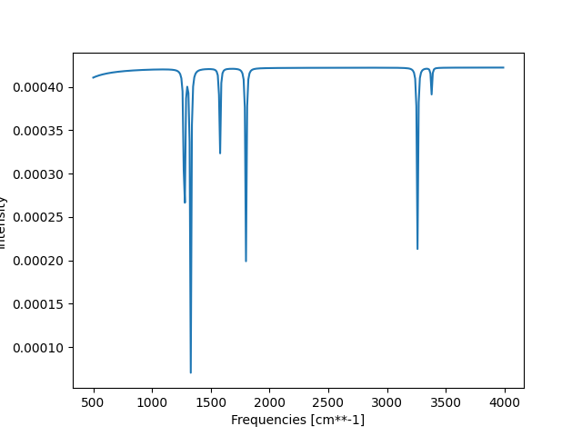
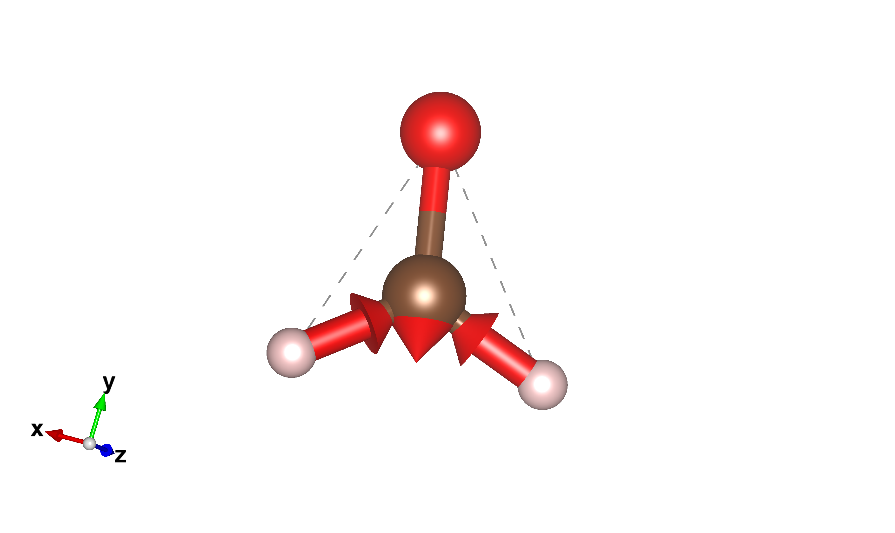
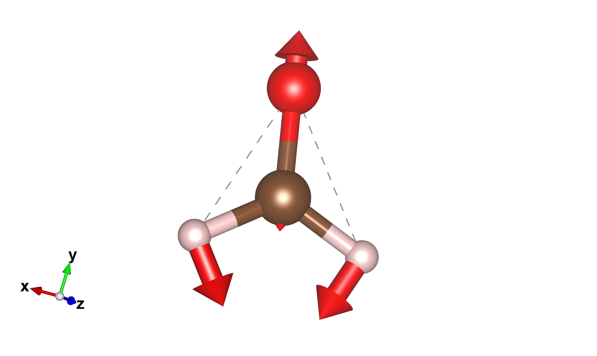

##################
振動解析プログラム
##################

************
ソースコード
************

.. toctree::

   XYZ_Freq

************
実行結果例
************
HCHO で計算した結果の一部

IR スペクトルの結果
*******************

基準振動の可視化結果
********************
Mode2: 3260 cm-1

Mode4: 1578 cm-1

